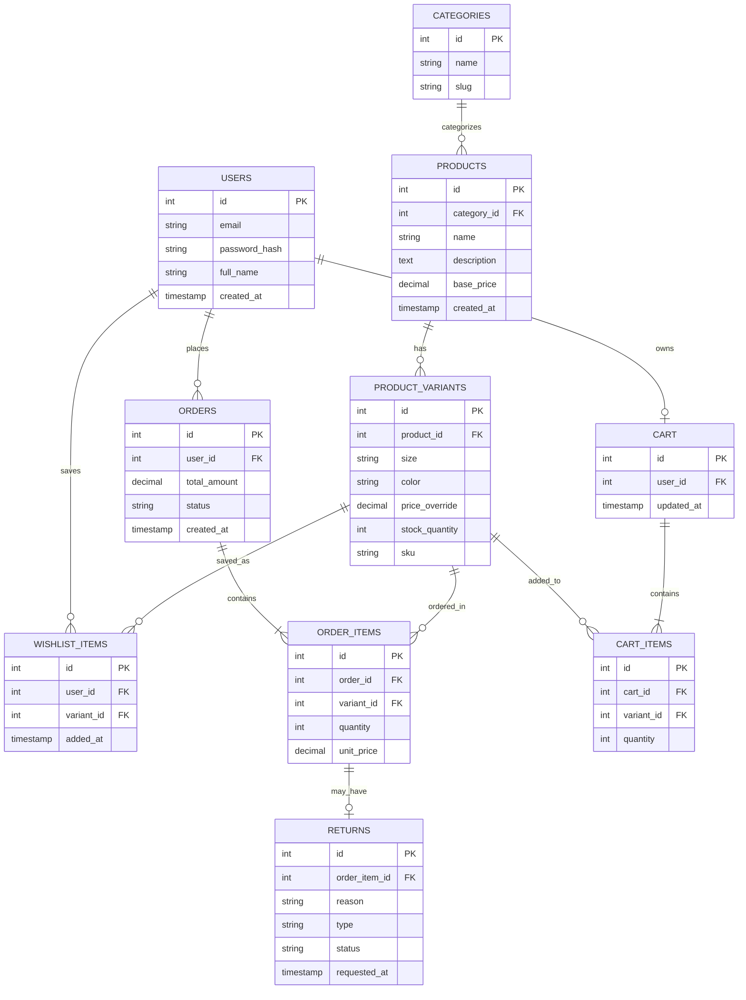

# Sprint 1: System Architecture & Scope Definition

**Course:** E-Commerce
**Repository:** `/docs/SPRINT_1.md`

---

## Section 1: Target Audience & Market Focus

**Primary Persona:**
Eco-conscious Gen Z and young millennial shoppers (18–30) who buy from independent streetwear and athletic-apparel brands rather than fast-fashion retailers. They are mobile-first, size-and-fit sensitive, and frequently return or exchange items rather than buying elsewhere in-store.

**Core Pain Point:**
Independent apparel brands struggle to sell online because generic e-commerce templates don't handle size/color variants well, making it hard for shoppers to tell what's actually in stock in their size — leading to abandoned carts and costly manual return/exchange handling for the seller.

**Domain Scope:**
Fashion & Apparel — specifically a single-vendor sustainable streetwear/activewear brand selling T-shirts, hoodies, and leggings in multiple sizes and colors. Single-vendor scope (not a multi-brand marketplace) to keep the build realistic for a semester timeline.

---

## Section 2: MVP Feature Scope Matrix

| Category | Feature Name | Description | Priority |
|---|---|---|---|
| Authentication | User Registration & Authentication | Password hashing (bcrypt) and JWT-based authentication mechanism. | High (MVP) |
| Catalog | Product List & Search | Product browsing with category filtering, plus size/color variant selection per product. | High (MVP) |
| Cart | Cart Management | Persistent cart state scoped to a specific product variant (size + color), with add/update/delete. | High (MVP) |
| Checkout | Order Processing | Stripe (test mode) payment gateway integration and order object instantiation, decrementing variant-level stock. | High (MVP) |
| Wishlist | Saved Items | Authenticated users can save products/variants to a wishlist for later purchase. | Medium |
| Returns | Return & Exchange Requests | Users can request a return or size exchange on a delivered order item; admin approves/rejects. | Medium |
| Admin | Inventory Control | Administrative CRUD operations for products, variants, and stock levels per size/color. | Medium |

Seven features total: the four High/MVP items form the core purchase funnel (auth → browse/select variant → cart → checkout). The three Medium-priority features are apparel-specific additions — wishlist, returns, and variant-aware admin control — that add meaningful data-modeling depth without threatening the core deliverable if time runs short.

---

## Section 3: Tech Stack Selection & Justification

**Frontend: HTML, CSS, JavaScript (Vanilla)**
Justification: A vanilla HTML/CSS/JS frontend keeps the build dependency-free and lets the team ship variant-aware UI (size/color pickers, product cards, cart line items) using the native DOM and `fetch` API directly against Supabase's auto-generated endpoints. This avoids the build-tooling overhead of a framework like React, which is a reasonable trade-off given the project's semester-scale scope and team size, at the cost of more manual state management as the UI grows.

**Backend Infrastructure: Supabase (Backend-as-a-Service)**
Justification: Supabase provides an auto-generated REST API and real-time subscriptions directly over a managed PostgreSQL database, plus built-in authentication (email/password, JWT issuance) and row-level security policies — removing the need to hand-write and host a custom Express server for standard CRUD operations. This lets the team focus engineering time on the harder domain logic (variant stock decrementing, return workflows) instead of boilerplate route handling, at the cost of some vendor lock-in and less flexibility than a fully custom backend.

**Database Management System: Supabase (Managed PostgreSQL)**
Justification: Apparel's variant model (Size × Color × Stock) and return workflows require strict relational integrity — a return must reference a specific order item, and a sale must atomically decrement the correct variant's stock, not the parent product's. Since Supabase is PostgreSQL under the hood, the project gets full ACID compliance, foreign key constraints, and row-level security for authorization, all managed and hosted without the team needing to provision or maintain a separate database server.

**Caching & Asynchronous Processing (Optional): Supabase Realtime**
Justification: Instead of a separate caching layer like Redis, Supabase's built-in Realtime subscriptions can push live stock-level updates (e.g., "only 2 left in this size") to the frontend without polling. A dedicated caching/job-queue layer is intentionally out of scope for this MVP given expected low order volume at semester scale.

---

## Section 4: Entity-Relationship Diagram (ERD)

### Relationship & Cardinality Notes

| Relationship | Cardinality | Description |
|---|---|---|
| USERS → ORDERS | 1:N | A user can place many orders; each order belongs to exactly one user. |
| USERS → CART | 1:1 | Each user has exactly one active cart. |
| USERS → WISHLIST_ITEMS | 1:N | A user can save many wishlist items. |
| CATEGORIES → PRODUCTS | 1:N | A category groups many products; each product belongs to one category. |
| PRODUCTS → PRODUCT_VARIANTS | 1:N | A product (e.g., "Essential Hoodie") has many variants (size/color combinations), each with its own stock. |
| PRODUCT_VARIANTS → CART_ITEMS | 1:N | A specific variant can appear in many carts; a cart item references exactly one variant. |
| PRODUCT_VARIANTS → WISHLIST_ITEMS | 1:N | A variant can be wishlisted by many users. |
| CART → CART_ITEMS | 1:N | A cart contains many cart items. |
| ORDERS → ORDER_ITEMS | 1:N | An order contains many order items (associative entity resolving the N:M between Orders and Variants). |
| PRODUCT_VARIANTS → ORDER_ITEMS | 1:N | A variant can appear across many order items over time. |
| ORDER_ITEMS → RETURNS | 1:1 (optional) | An order item may have at most one active return/exchange request. |

**Primary Keys (PK):** `id` on every entity.
**Foreign Keys (FK):** `ORDERS.user_id → USERS.id`, `CART.user_id → USERS.id`, `CART_ITEMS.cart_id → CART.id`, `CART_ITEMS.variant_id → PRODUCT_VARIANTS.id`, `WISHLIST_ITEMS.user_id → USERS.id`, `WISHLIST_ITEMS.variant_id → PRODUCT_VARIANTS.id`, `PRODUCT_VARIANTS.product_id → PRODUCTS.id`, `PRODUCTS.category_id → CATEGORIES.id`, `ORDER_ITEMS.order_id → ORDERS.id`, `ORDER_ITEMS.variant_id → PRODUCT_VARIANTS.id`, `RETURNS.order_item_id → ORDER_ITEMS.id`.

**Why variants matter here:** Stock and price live on `PRODUCT_VARIANTS`, not `PRODUCTS`. This is the key modeling decision that separates an apparel schema from a flat electronics schema — a "Medium Blue Hoodie" and a "Large Black Hoodie" are different sellable units with independent stock counts, even though they share one parent product listing.

---
