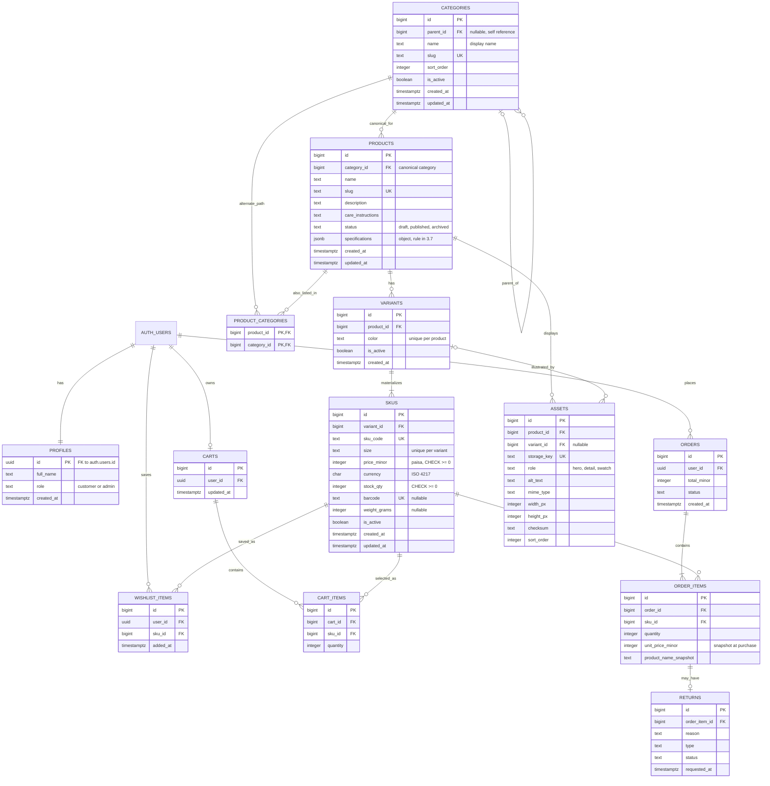

# Sprint 2: Catalog Data Foundation

**Course:** E-Commerce
**Repository:** `/docs/SPRINT_2.md`
**Builds on:** [`SPRINT_1.md`](./SPRINT_1.md) (architecture, scope, ERD) and Week 3 (*From Product Story to SKU Matrix*)
**Stack (from Sprint 1):** Vanilla HTML/CSS/JS · Supabase (managed PostgreSQL, auto-generated REST API, Auth, Row-Level Security)

> **How to use this file:** The design decisions are ready to review and adopt. Anything marked `TODO(evidence)` must be replaced with your own real output (request/response captures, test results). Do not submit placeholder evidence.

---

## Section 1: Sprint Goal & Scope Boundary

**Sprint goal:** Given a product catalog administrator, the system persists categories, products, variants, and SKUs without losing identity, relationship, price, or inventory meaning.

**Duration:** 15 days, with demos at the end of Days 5, 10, and 15.

### In scope

| ID | Capability | What it means for our apparel store |
|---|---|---|
| CAT01 | Categories | Admin can create, update, deactivate, and list categories (e.g., Clothing → Hoodies). Unique slug, optional single parent, never its own ancestor. |
| CAT02 | Product identity | Admin can create and edit a product (name, slug, description, status, canonical category). Slugs are unique. |
| CAT03 | Variants & SKUs | A product has zero or more variants (colors). Each variant has sellable SKUs (sizes). Each SKU has a unique code, its own price, and its own stock. |
| CAT04 | Valid combinations only | A combination we do not make (e.g., Sand / S) has **no row**. We never invent a fake or zero-stock SKU for it. |
| CAT05 | Data integrity | Uniqueness, foreign keys, non-negative stock, and non-negative price are enforced by the **database**, not only by the API. |
| CAT06 | Admin access | All write operations reject unauthenticated and non-admin callers (RLS + admin role). |

### Out of scope (Sprint 3 or later)

Dynamic specification validation and editing UI, asset upload and image processing, public catalog search, publication workflows beyond the simple status rule below, Stripe checkout, order placement, shipping, wishlist UI, and the returns workflow.

The `assets` table, `product_categories` table, and `products.specifications` column exist so Sprint 3 has a foundation, but **no upload, search, or spec-editing functionality is claimed for Sprint 2**.

---

## Section 2: Link to Sprint 1 and Week 3 Decisions

### 2.1 Sprint 1 decisions reused or changed

| Sprint 1 decision | Sprint 2 treatment | Reason |
|---|---|---|
| Single-vendor sustainable streetwear (T-shirts, hoodies, leggings) | **Reused** | Seed data and examples use this domain. |
| Supabase (PostgreSQL, REST, Auth, RLS) | **Reused** | Migrations are SQL files in `supabase/migrations/`; admin access uses RLS. |
| Vanilla JS frontend with `fetch` | **Reused** | The admin demo calls Supabase REST endpoints with `fetch`. |
| `PRODUCT_VARIANTS` held size, color, price, stock, and sku in one table | **Changed** | Split into `VARIANTS` (color) and `SKUS` (size, code, price, stock, barcode, weight), matching the Week 3 Product → Variant → SKU vocabulary. |
| `PRODUCTS.base_price` and `PRODUCT_VARIANTS.price_override` | **Changed** | Removed. Price lives only on `SKUS.price_minor`. Two sources of price truth cause bugs. |
| `decimal` money | **Changed** | Integer minor units (`price_minor`, paisa for PKR). No floating-point money. |
| `CART_ITEMS`, `ORDER_ITEMS`, `WISHLIST_ITEMS` referenced `variant_id` | **Changed** | Now reference `sku_id`, because the SKU is the unit that has a price and stock. |
| `ORDER_ITEMS.unit_price` | **Reused (renamed)** | `unit_price_minor`, a price snapshot taken at purchase time. |
| `USERS` table with `password_hash` | **Changed** | Supabase Auth owns credentials (`auth.users`). We add `profiles` with a `role` (`customer` / `admin`). |
| `int` primary keys | **Changed** | `bigint generated always as identity`. |
| `CATEGORIES(id, name, slug)` only | **Extended** | Adds `parent_id`, `is_active`, `sort_order`, timestamps (Week 3 tree requirements). |
| Admin CRUD was "Medium" priority | **Promoted** | It is the main Sprint 2 deliverable because the catalog cannot exist without it. |

### 2.2 Week 3 concepts applied

| Week 3 concept | Where it appears in Sprint 2 |
|---|---|
| Product = customer-facing concept; Variant = configuration; SKU = sellable stock unit with its own price, barcode, inventory | Tables `products`, `variants`, `skus` (Section 3) |
| Shared vs. variable vs. sellable attributes | Table in Section 3.1 |
| Category tree: parent–child, stable slug and display name, sort order, active status | `categories` table and tree RPC (Sections 3.5, 3.9) |
| One canonical category for ownership + optional many-to-many for alternate discovery paths | `products.category_id` + `product_categories` (Section 3.5, Q2) |
| Cardinality is a business decision (Product 1 → Variant 0..n → SKU 1..n; Product → Category 1..n; Asset 0..n) | Section 3.3 |
| SKU matrix; missing combinations without a fake SKU | Section 3.4 and seed data |
| Keep identity, price, inventory, relationships relational; JSONB or EAV only for dynamic specs with a validation strategy | Section 3.7 |
| Asset roles are data; metadata to keep; upload pipeline | `assets` table and Section 3.8 |
| Red-team questions (no variants? two parents? where does stock live? asset deleted?) | Section 5.4 |
| "Every promise in the business story has a data record" | Appendix A (capstone trace) |

---

## Section 3: Updated ERD & Data Dictionary

### 3.1 Shared, variable, and sellable (Week 3 vocabulary applied to our store)

| Level | Table | Example: "Essential Tee" | Attributes held here |
|---|---|---|---|
| **Product** (shared, customer-facing story) | `products` | Essential Tee | name, slug, description, care instructions, status, canonical category, specifications |
| **Variant** (what varies visually) | `variants` | Black, Sand | color; owns the color's images (hero, swatch) |
| **SKU** (sellable unit) | `skus` | `TEE-BLK-M` | SKU code, size, price, stock, barcode, shipping weight, active flag |

**Rule:** if a value needs joins, constraints, sorting, or frequent filtering (price, stock, size, slug), it is a **relational column**. Only genuinely dynamic, category-specific facts go into JSONB specifications (Section 3.7).

### 3.2 ERD



> `CARTS`, `CART_ITEMS`, `ORDERS`, `ORDER_ITEMS`, `WISHLIST_ITEMS`, and `RETURNS` are **not fully built in Sprint 2**. Only their SKU foreign-key contract is created, so Sprint 1's purchase funnel connects cleanly.
>
> **Deviation from the manual's sample diagram:** the sample links `PRODUCTS → CART_ITEMS`. We link `SKUS → CART_ITEMS` instead, because a cart line must identify the exact size and color being bought, and the SKU is the record that owns price and stock. This also matches Sprint 1, where cart items already pointed to the most specific sellable record.

### 3.3 Relationships, cardinality, and delete/update policy

Week 3 cardinality is applied as follows: Product 1 → Variant 0..n → SKU 1..n; Product → Category 1..n (one canonical plus optional alternates); Asset 0..n.

| Relationship | Cardinality | Foreign key | ON DELETE | ON UPDATE | Reason |
|---|---|---|---|---|---|
| Category → Category (parent) | 0..1 : N | `categories.parent_id` | RESTRICT | CASCADE | A category with children cannot be deleted; deactivate instead. A category has **at most one parent** (a tree, not a graph). |
| Category → Product (canonical) | 1 : N | `products.category_id` | RESTRICT | CASCADE | Canonical category is mandatory. A category with products cannot be deleted. |
| Product ↔ Category (alternate) | N : M | `product_categories.*` | CASCADE (product), RESTRICT (category) | CASCADE | Removing a product removes its alternate links; a category still used for discovery cannot be deleted. |
| Product → Variant | 1 : 0..N | `variants.product_id` | CASCADE | CASCADE | Variants have no meaning without the product. |
| Variant → SKU | 1 : 1..N | `skus.variant_id` | CASCADE | CASCADE | Same reasoning. A product with sold SKUs still cannot be hard-deleted because `order_items` restricts. |
| Product → Asset | 1 : 0..N | `assets.product_id` | CASCADE | CASCADE | Images belong to the product. |
| Variant → Asset | 0..1 : N | `assets.variant_id` | CASCADE | CASCADE | A color's images are removed with the color. This avoids orphaned images falling back to product level and breaking the one-hero rule. |
| SKU → Cart item | 1 : N | `cart_items.sku_id` | CASCADE | CASCADE | A removed SKU disappears from carts. |
| SKU → Wishlist item | 1 : N | `wishlist_items.sku_id` | CASCADE | CASCADE | Same. |
| SKU → Order item | 1 : N | `order_items.sku_id` | **RESTRICT** | CASCADE | History must never lose its SKU. This also blocks hard-deleting anything that has ever been sold. |

### 3.4 SKU matrix (valid combinations only)

For the product **Essential Tee** (colors × sizes). A dash means the combination is **not produced and has no row**.

| | S | M | L |
|---|---|---|---|
| **Black** | `TEE-BLK-S` (20 in stock) | `TEE-BLK-M` (15) | `TEE-BLK-L` (**0 in stock**) |
| **Sand** | **—** (not produced) | `TEE-SND-M` (10) | `TEE-SND-L` (5) |

Two different situations that must never be confused:

| Situation | Database representation | Customer sees |
|---|---|---|
| Sand / S is not made | **No row** | Option not offered |
| Black / L is made but sold out | Row exists, `is_active = true`, `stock_qty = 0` | Option shown as sold out |

Enforcement: `UNIQUE (variant_id, size)` prevents duplicate cells; there is no code path that creates "placeholder" SKUs.

### 3.5 Category tree and taxonomy

**Tree fields (Week 3):** parent–child relationship, stable slug and display name, sort order, active status.

```
Clothing (root)
├── T-Shirts
├── Hoodies
└── Leggings
Activewear (root)          <- used only as an alternate discovery path
```

**Canonical + alternate rule:** every product has exactly **one canonical category** (`products.category_id`) that owns it (used for URLs, breadcrumbs, and reporting). It may also appear in **alternate categories** through `product_categories`, which only affects discovery. Example: Flow Leggings is canonical in *Clothing → Leggings* and discoverable under *Activewear*. This is the "one canonical + optional many-to-many" answer suggested in Week 3.

### 3.6 Data dictionary

**`categories`**

| Column | Type | Constraints | Notes |
|---|---|---|---|
| id | bigint | PK, identity | |
| parent_id | bigint | FK → categories.id, nullable, `CHECK (parent_id IS DISTINCT FROM id)` | Deeper cycles blocked by trigger. |
| name | text | NOT NULL, non-blank | Display name. |
| slug | text | NOT NULL, UNIQUE, `^[a-z0-9]+(-[a-z0-9]+)*$` | Stable identifier for URLs. |
| sort_order | integer | NOT NULL, default 0 | Order among siblings. |
| is_active | boolean | NOT NULL, default true | Soft deactivation. |
| created_at, updated_at | timestamptz | NOT NULL, default now() | `updated_at` set by trigger. |

**`products`**

| Column | Type | Constraints | Notes |
|---|---|---|---|
| id | bigint | PK, identity | |
| category_id | bigint | NOT NULL, FK → categories.id | Canonical category. |
| name | text | NOT NULL, non-blank | |
| slug | text | NOT NULL, UNIQUE, slug format | |
| description | text | NOT NULL, default '' | Shared story. |
| care_instructions | text | NOT NULL, default '' | Shared; a plain content column (Week 3: care instructions are relational content). |
| status | text | NOT NULL, default `'draft'`, `IN ('draft','published','archived')` | |
| specifications | jsonb | NOT NULL, default `{}`, `jsonb_typeof = 'object'` | Rule in 3.7. |
| created_at, updated_at | timestamptz | NOT NULL | |

**`product_categories`**: `product_id` (FK, PK part), `category_id` (FK, PK part). Composite primary key prevents duplicate links. A trigger forbids linking a product to its own canonical category.

**`variants`**

| Column | Type | Constraints |
|---|---|---|
| id | bigint | PK, identity |
| product_id | bigint | NOT NULL, FK → products.id |
| color | text | NOT NULL, non-blank, unique per product (case-insensitive) |
| is_active | boolean | NOT NULL, default true |
| created_at | timestamptz | NOT NULL |

**`skus`**

| Column | Type | Constraints | Notes |
|---|---|---|---|
| id | bigint | PK, identity | |
| variant_id | bigint | NOT NULL, FK → variants.id | |
| sku_code | text | NOT NULL, UNIQUE, `^[A-Z0-9]+(-[A-Z0-9]+)*$` | e.g., `TEE-BLK-M`. |
| size | text | NOT NULL, `IN ('XS','S','M','L','XL','XXL','OS')`, unique per variant | `OS` = one size. |
| price_minor | integer | NOT NULL, `>= 0` | Paisa. 250000 = Rs. 2,500. |
| currency | char(3) | NOT NULL, default `'PKR'` | |
| stock_qty | integer | NOT NULL, default 0, `>= 0` | The only place stock lives. |
| barcode | text | UNIQUE, nullable | Week 3: SKU carries barcode. |
| weight_grams | integer | nullable, `> 0` | Week 3: shipping weight. |
| is_active | boolean | NOT NULL, default true | |
| created_at, updated_at | timestamptz | NOT NULL | |

**`assets`** (structure only in Sprint 2)

| Column | Type | Constraints | Notes |
|---|---|---|---|
| id | bigint | PK, identity | |
| product_id | bigint | NOT NULL, FK → products.id | |
| variant_id | bigint | FK → variants.id, nullable | Set for color-specific images. |
| storage_key | text | NOT NULL, UNIQUE | Object path in storage, not a filename trusted from the user. |
| role | text | NOT NULL, `IN ('hero','detail','swatch')` | Asset roles are data. |
| alt_text | text | NOT NULL, default '' | Helps screen readers. |
| mime_type | text | NOT NULL, `IN ('image/jpeg','image/png','image/webp')` | Helps delivery. |
| width_px, height_px | integer | nullable, `> 0` | Helps delivery. |
| checksum | text | nullable | Integrity and de-duplication. |
| sort_order | integer | NOT NULL, default 0 | |

Extra constraint: **at most one `hero` per (product, variant)** via a partial unique index.

**`profiles`**: `id` (uuid PK, FK → auth.users), `full_name`, `role` (`customer` / `admin`, default `customer`), `created_at`.

### 3.7 Specification decision: JSONB vs. EAV

**Choice:** validated **JSONB on `products.specifications`**.

| Criterion | EAV (`product_attribute(product_id, attribute_id, value)`) | JSONB document | Our decision |
|---|---|---|---|
| Strong attribute catalog | Yes | Needs an external allow-list | Allow-list defined in this document, enforced fully in Sprint 3 |
| Flexible per-category fields | Yes | Yes | Needed: leggings and hoodies have different facts |
| Joins and validation work | Many joins | Few joins | Small catalog, no cross-product attribute filtering in MVP, so fewer joins wins |
| Nested or array values | Awkward | Natural | `certifications` is a list |
| Indexing and consistency | Easier typing | Needs care (GIN index, validation) | Accepted trade-off, mitigated by the rule below |

**Field-by-field vote (Week 3 challenge, applied to our store):**

| Field | Storage | Why |
|---|---|---|
| SKU price | Relational column | Needs constraints, sorting, and exact arithmetic. |
| Size / color | Relational columns | Drive the SKU matrix and uniqueness. |
| Care instructions | Relational content column | Shared by every variant; no filtering needed. |
| Fabric composition, recycled content %, certifications, water resistance | JSONB | Differ by category; sparse. |

**Validation rule (written):** `specifications` must be a JSON object. Keys come from this allow-list: `fabric_composition` (string), `fit` (string), `recycled_content_percent` (number 0-100), `certifications` (array of strings), `origin` (string), `water_resistance` (string). Maximum 20 keys; no nested objects.

**Enforcement:** In Sprint 2 the database enforces only "must be a JSON object" (`CHECK`). Full key and value validation is delivered in Sprint 3 with the spec editor (see Section 8). This gap is documented, not hidden.

### 3.8 Asset workflow (design now, build in Sprint 3)

```
Upload → Validate (type, size) → Store object → Resize/optimize → Link to variant
```

Metadata we keep per image: MIME type, dimensions, checksum, storage key, role, alt text, ordering (all columns exist in `assets`).

Security checkpoint: never trust the filename. Validate content type, authorize that the uploader is an admin, and scan before public delivery.

How an image becomes linked to a variant: the `assets` row stores `product_id` plus `variant_id`. A color-specific hero image (Black) sets both; a general product image sets only `product_id`.

Example roles: a zipper close-up uses `detail`; the color chip uses `swatch`; the main photo uses `hero`. `alt_text` helps screen readers; `mime_type`, `width_px`, and `height_px` help image delivery.

### 3.9 Migration: schema

File: `supabase/migrations/0001_catalog_foundation.sql`

```sql
-- Helpers -------------------------------------------------------------
create or replace function public.set_updated_at() returns trigger
language plpgsql as $$
begin new.updated_at = now(); return new; end $$;

-- Profiles and admin check -------------------------------------------
create table public.profiles (
  id         uuid primary key references auth.users(id) on delete cascade,
  full_name  text,
  role       text not null default 'customer' check (role in ('customer','admin')),
  created_at timestamptz not null default now()
);

create or replace function public.handle_new_user() returns trigger
language plpgsql security definer set search_path = public as $$
begin
  insert into public.profiles (id, full_name)
  values (new.id, new.raw_user_meta_data ->> 'full_name');
  return new;
end $$;

create trigger on_auth_user_created after insert on auth.users
  for each row execute function public.handle_new_user();

create or replace function public.is_admin() returns boolean
language sql stable security definer set search_path = public as $$
  select exists (select 1 from public.profiles where id = auth.uid() and role = 'admin');
$$;

-- Categories ----------------------------------------------------------
create table public.categories (
  id         bigint generated always as identity primary key,
  parent_id  bigint references public.categories(id) on delete restrict on update cascade,
  name       text not null check (length(trim(name)) > 0),
  slug       text not null unique check (slug ~ '^[a-z0-9]+(-[a-z0-9]+)*$'),
  sort_order integer not null default 0,
  is_active  boolean not null default true,
  created_at timestamptz not null default now(),
  updated_at timestamptz not null default now(),
  check (parent_id is distinct from id)
);
create index on public.categories(parent_id);

create or replace function public.prevent_category_cycle() returns trigger
language plpgsql as $$
begin
  if new.parent_id is null then return new; end if;
  if exists (
    with recursive ancestors as (
      select id, parent_id from public.categories where id = new.parent_id
      union all
      select c.id, c.parent_id from public.categories c join ancestors a on c.id = a.parent_id
    )
    select 1 from ancestors where id = new.id
  ) then
    raise exception 'category_cycle: category % cannot be its own ancestor', new.id
      using errcode = 'P0001';
  end if;
  return new;
end $$;

create trigger trg_category_cycle before insert or update of parent_id on public.categories
  for each row execute function public.prevent_category_cycle();
create trigger trg_categories_updated before update on public.categories
  for each row execute function public.set_updated_at();

-- Products ------------------------------------------------------------
create table public.products (
  id                bigint generated always as identity primary key,
  category_id       bigint not null references public.categories(id) on delete restrict on update cascade,
  name              text not null check (length(trim(name)) > 0),
  slug              text not null unique check (slug ~ '^[a-z0-9]+(-[a-z0-9]+)*$'),
  description       text not null default '',
  care_instructions text not null default '',
  status            text not null default 'draft' check (status in ('draft','published','archived')),
  specifications    jsonb not null default '{}'::jsonb check (jsonb_typeof(specifications) = 'object'),
  created_at        timestamptz not null default now(),
  updated_at        timestamptz not null default now()
);
create index on public.products(category_id);
create trigger trg_products_updated before update on public.products
  for each row execute function public.set_updated_at();

-- Alternate discovery categories -------------------------------------
create table public.product_categories (
  product_id  bigint not null references public.products(id)   on delete cascade   on update cascade,
  category_id bigint not null references public.categories(id) on delete restrict  on update cascade,
  primary key (product_id, category_id)
);

create or replace function public.forbid_canonical_as_alternate() returns trigger
language plpgsql as $$
begin
  if exists (select 1 from public.products p
             where p.id = new.product_id and p.category_id = new.category_id) then
    raise exception 'alternate_equals_canonical: category is already the canonical category'
      using errcode = 'P0001';
  end if;
  return new;
end $$;

create trigger trg_alt_category before insert or update on public.product_categories
  for each row execute function public.forbid_canonical_as_alternate();

-- Variants (color level) ---------------------------------------------
create table public.variants (
  id         bigint generated always as identity primary key,
  product_id bigint not null references public.products(id) on delete cascade on update cascade,
  color      text not null check (length(trim(color)) > 0),
  is_active  boolean not null default true,
  created_at timestamptz not null default now()
);
create unique index variants_product_color_uq on public.variants(product_id, lower(color));

-- SKUs (size level, the sellable unit) -------------------------------
create table public.skus (
  id           bigint generated always as identity primary key,
  variant_id   bigint not null references public.variants(id) on delete cascade on update cascade,
  sku_code     text not null unique check (sku_code ~ '^[A-Z0-9]+(-[A-Z0-9]+)*$'),
  size         text not null check (size in ('XS','S','M','L','XL','XXL','OS')),
  price_minor  integer not null check (price_minor >= 0),
  currency     char(3) not null default 'PKR',
  stock_qty    integer not null default 0 check (stock_qty >= 0),
  barcode      text unique,
  weight_grams integer check (weight_grams > 0),
  is_active    boolean not null default true,
  created_at   timestamptz not null default now(),
  updated_at   timestamptz not null default now(),
  unique (variant_id, size)
);
create trigger trg_skus_updated before update on public.skus
  for each row execute function public.set_updated_at();

-- Publish rule (created after variants and skus exist) ----------------
create or replace function public.enforce_publish_rule() returns trigger
language plpgsql as $$
begin
  if new.status = 'published' and not exists (
    select 1 from public.skus s join public.variants v on v.id = s.variant_id
    where v.product_id = new.id and s.is_active and v.is_active
  ) then
    raise exception 'publish_requires_active_sku: product % has no active SKU', new.id
      using errcode = 'P0001';
  end if;
  return new;
end $$;

create trigger trg_publish_rule before insert or update of status on public.products
  for each row execute function public.enforce_publish_rule();

-- Assets (structure only in Sprint 2) --------------------------------
create table public.assets (
  id          bigint generated always as identity primary key,
  product_id  bigint not null references public.products(id) on delete cascade on update cascade,
  variant_id  bigint references public.variants(id) on delete cascade on update cascade,
  storage_key text not null unique,
  role        text not null check (role in ('hero','detail','swatch')),
  alt_text    text not null default '',
  mime_type   text not null check (mime_type in ('image/jpeg','image/png','image/webp')),
  width_px    integer check (width_px > 0),
  height_px   integer check (height_px > 0),
  checksum    text,
  sort_order  integer not null default 0
);
-- At most one hero image per (product, variant)
create unique index assets_one_hero_uq
  on public.assets (product_id, coalesce(variant_id, 0)) where role = 'hero';
```

### 3.10 Migration: connecting Sprint 1 tables

File: `supabase/migrations/0002_sprint1_sku_links.sql`

These Sprint 1 tables are only stubs in Sprint 2. Their job is to **lock the SKU foreign-key contract**. If your team already created them, use `alter table` instead of recreating.

```sql
create table public.carts (
  id         bigint generated always as identity primary key,
  user_id    uuid not null unique references auth.users(id) on delete cascade,
  updated_at timestamptz not null default now()
);

create table public.cart_items (
  id       bigint generated always as identity primary key,
  cart_id  bigint not null references public.carts(id) on delete cascade,
  sku_id   bigint not null references public.skus(id)  on delete cascade,
  quantity integer not null check (quantity > 0),
  unique (cart_id, sku_id)
);

create table public.orders (
  id          bigint generated always as identity primary key,
  user_id     uuid not null references auth.users(id) on delete restrict,
  total_minor integer not null check (total_minor >= 0),
  status      text not null default 'pending',
  created_at  timestamptz not null default now()
);

create table public.order_items (
  id                    bigint generated always as identity primary key,
  order_id              bigint not null references public.orders(id) on delete cascade,
  sku_id                bigint not null references public.skus(id)   on delete restrict,
  quantity              integer not null check (quantity > 0),
  unit_price_minor      integer not null check (unit_price_minor >= 0),
  product_name_snapshot text not null
);

create table public.wishlist_items (
  id       bigint generated always as identity primary key,
  user_id  uuid not null references auth.users(id) on delete cascade,
  sku_id   bigint not null references public.skus(id) on delete cascade,
  added_at timestamptz not null default now(),
  unique (user_id, sku_id)
);
```

`returns` is deferred to its own sprint.

### 3.11 Row-Level Security (authorization)

File: `supabase/migrations/0003_rls_admin_only.sql`

```sql
alter table public.profiles           enable row level security;
alter table public.categories         enable row level security;
alter table public.products           enable row level security;
alter table public.product_categories enable row level security;
alter table public.variants           enable row level security;
alter table public.skus               enable row level security;
alter table public.assets             enable row level security;

-- Anonymous users get no direct access to catalog tables in Sprint 2.
-- (Public read policies are a Sprint 3 deliverable.)
revoke all on public.categories, public.products, public.product_categories,
              public.variants, public.skus, public.assets, public.profiles from anon;

create policy admin_all_categories on public.categories for all to authenticated
  using (public.is_admin()) with check (public.is_admin());
create policy admin_all_products on public.products for all to authenticated
  using (public.is_admin()) with check (public.is_admin());
create policy admin_all_product_categories on public.product_categories for all to authenticated
  using (public.is_admin()) with check (public.is_admin());
create policy admin_all_variants on public.variants for all to authenticated
  using (public.is_admin()) with check (public.is_admin());
create policy admin_all_skus on public.skus for all to authenticated
  using (public.is_admin()) with check (public.is_admin());
create policy admin_all_assets on public.assets for all to authenticated
  using (public.is_admin()) with check (public.is_admin());

-- Users can read their own profile but can NEVER change their own role.
create policy profile_read_own on public.profiles for select to authenticated
  using (id = auth.uid());
revoke update (role) on public.profiles from authenticated;
```

### 3.12 Category tree helper

```sql
create or replace function public.admin_category_tree()
returns table (id bigint, parent_id bigint, name text, slug text, sort_order int,
               is_active boolean, effective_active boolean, depth int, path text)
language sql stable security invoker as $$
  with recursive tree as (
    select c.id, c.parent_id, c.name, c.slug, c.sort_order, c.is_active,
           c.is_active as effective_active, 0 as depth, c.name::text as path
    from public.categories c where c.parent_id is null
    union all
    select c.id, c.parent_id, c.name, c.slug, c.sort_order, c.is_active,
           (t.effective_active and c.is_active), t.depth + 1, t.path || ' > ' || c.name
    from public.categories c join tree t on c.parent_id = t.id
  )
  select * from tree order by path;
$$;
```

`security invoker` means the function runs with the caller's permissions, so RLS still applies and non-admins receive no rows.

---

## Section 4: Administration Route Table

Supabase exposes tables through PostgREST at `https://<PROJECT_REF>.supabase.co/rest/v1/`. The manual allows "an equivalent convention", so the required routes map as follows.

**Headers on every request:**

```
apikey: <SUPABASE_ANON_KEY>
Authorization: Bearer <ADMIN_USER_JWT>      # redacted in all evidence
Content-Type: application/json
Prefer: return=representation                # POST/PATCH return the saved row
```

| Manual route | Implemented route | Purpose |
|---|---|---|
| `POST /api/v1/admin/categories` | `POST /rest/v1/categories` | Create a category |
| *(update / deactivate)* | `PATCH /rest/v1/categories?id=eq.<id>` | Rename, re-parent, reorder, or set `is_active=false` |
| `GET /api/v1/admin/categories` | `POST /rest/v1/rpc/admin_category_tree` | Return the category tree |
| `POST /api/v1/admin/products` | `POST /rest/v1/products` | Create a draft product |
| `PATCH /api/v1/admin/products/:id` | `PATCH /rest/v1/products?id=eq.<id>` | Update content or status |
| `GET /api/v1/admin/products` | `GET /rest/v1/products?select=*,variants(*,skus(*))` | Admin product records with nested variants and SKUs |
| *(not in baseline)* | `POST /rest/v1/variants` | Add a color variant |
| *(not in baseline)* | `POST /rest/v1/product_categories` | Add an alternate discovery category |
| `POST /api/v1/admin/products/:id/skus` | `POST /rest/v1/skus` (body has `variant_id`) | Add a SKU. The product is reached through the variant. |
| `PATCH /api/v1/admin/skus/:id` | `PATCH /rest/v1/skus?id=eq.<id>` | Update price, stock, or active status |

> **Confirm with your instructor:** if literal `/api/v1/admin/...` paths are required, wrap these calls in one Supabase Edge Function named `admin-api` that forwards to the same tables using the caller's JWT. The database rules in Section 5 do not change either way.

### 4.1 Contract and examples

#### Create category: `POST /rest/v1/categories`

Fields: `name`, `slug` (required) · `parent_id`, `sort_order`, `is_active` (optional).

```json
{ "name": "Hoodies", "slug": "hoodies", "parent_id": 1, "sort_order": 2 }
```

`201 Created`:

```json
[{ "id": 3, "parent_id": 1, "name": "Hoodies", "slug": "hoodies", "sort_order": 2,
   "is_active": true, "created_at": "2026-10-05T09:12:44Z", "updated_at": "2026-10-05T09:12:44Z" }]
```

Status codes: `201` created · `400` bad slug format or cycle · `401` no JWT · `403` not admin · `409` duplicate slug or unknown `parent_id`.

#### Deactivate category: `PATCH /rest/v1/categories?id=eq.3`

```json
{ "is_active": false }
```

`200 OK` with the updated row. Children keep their own flag but become *effectively inactive* (Section 5, Q3).

#### Category tree: `POST /rest/v1/rpc/admin_category_tree`

Body `{}`. `200 OK`:

```json
[
  { "id": 1, "parent_id": null, "name": "Clothing", "slug": "clothing", "sort_order": 0,
    "is_active": true, "effective_active": true, "depth": 0, "path": "Clothing" },
  { "id": 3, "parent_id": 1, "name": "Hoodies", "slug": "hoodies", "sort_order": 2,
    "is_active": true, "effective_active": true, "depth": 1, "path": "Clothing > Hoodies" }
]
```

#### Create draft product: `POST /rest/v1/products`

Fields: `category_id`, `name`, `slug` (required) · `description`, `care_instructions`, `specifications` (optional). `status` defaults to `draft`.

```json
{ "category_id": 3, "name": "Studio Hoodie", "slug": "studio-hoodie",
  "description": "Heavyweight recycled-fleece hoodie.",
  "care_instructions": "Machine wash cold. Hang dry." }
```

`201 Created`: the product row with `"status": "draft"`.

#### Update product: `PATCH /rest/v1/products?id=eq.2`

Any subset of `name`, `slug`, `description`, `care_instructions`, `status`, `category_id`, `specifications`.

```json
{ "status": "published" }
```

Responses: `200` updated row · `400` `publish_requires_active_sku` · `409` duplicate slug.

#### Add variant: `POST /rest/v1/variants`

```json
{ "product_id": 2, "color": "Forest Green" }
```

`201`. A second "Forest Green" on the same product returns `409`.

#### Add alternate category: `POST /rest/v1/product_categories`

```json
{ "product_id": 3, "category_id": 5 }
```

`201`. Using the product's own canonical category returns `400` (`alternate_equals_canonical`); repeating a link returns `409`.

#### Add SKU: `POST /rest/v1/skus`

Fields: `variant_id`, `sku_code`, `size`, `price_minor` (required) · `stock_qty`, `currency`, `barcode`, `weight_grams`, `is_active` (optional).

```json
{ "variant_id": 3, "sku_code": "HOOD-FGR-M", "size": "M",
  "price_minor": 650000, "stock_qty": 12, "weight_grams": 650 }
```

`201 Created`:

```json
[{ "id": 6, "variant_id": 3, "sku_code": "HOOD-FGR-M", "size": "M",
   "price_minor": 650000, "currency": "PKR", "stock_qty": 12,
   "barcode": null, "weight_grams": 650, "is_active": true }]
```

#### Update SKU: `PATCH /rest/v1/skus?id=eq.6`

```json
{ "price_minor": 590000, "stock_qty": 8 }
```

`200` with the updated row. Negative stock returns `400`.

#### List products: `GET /rest/v1/products?select=*,variants(*,skus(*))&order=id.asc`

`200 OK`. Each product contains a `variants` array, and each variant contains a `skus` array. This one response lets a reviewer distinguish product, variant, and SKU.

### 4.2 Consistent error responses

PostgREST returns JSON errors, never a stack trace:

```json
{ "code": "23505", "details": "Key (slug)=(studio-hoodie) already exists.",
  "hint": null, "message": "duplicate key value violates unique constraint \"products_slug_key\"" }
```

| Situation | HTTP | Code | Suggested message |
|---|---|---|---|
| Duplicate product/category slug | 409 | 23505 | "That slug is already in use." |
| Duplicate SKU code, barcode, or (variant, size) | 409 | 23505 | "That SKU code, barcode, or size already exists." |
| Unknown foreign key | 409 | 23503 | "Selected parent record does not exist." |
| Negative stock/price, bad status/size/role | 400 | 23514 | "Value is outside the allowed range." |
| Missing required field | 400 | 23502 | "Field X is required." |
| Category cycle, publish without SKU, alternate = canonical | 400 | P0001 | Show the `message`. |
| No JWT | 401 | 42501 | "Please sign in." |
| Signed in, not admin (write) | 403 | 42501 | "Administrator access required." |

> **RLS behavior to document honestly:** for a signed-in **non-admin**, a `GET` on an admin table returns `200 []`, not `403`, because RLS silently filters rows. Writes by non-admins are rejected with `403`. Our authorization tests assert both.

`TODO(evidence)`: capture one real request/response pair per route above, with tokens and project URLs redacted (see Section 6).

---

## Section 5: Data Integrity & Authorization Decisions

### 5.1 What the database enforces (CAT05)

| Rule | Mechanism |
|---|---|
| Unique category slug, product slug, SKU code, barcode | `UNIQUE` constraints |
| One size per variant; one color per product | `UNIQUE (variant_id, size)`; unique index on `(product_id, lower(color))` |
| Stock cannot go negative | `CHECK (stock_qty >= 0)` |
| Price cannot be negative; no floating-point money | `integer price_minor` with `CHECK (price_minor >= 0)` |
| Valid status, size, asset role, MIME type | `CHECK ... IN (...)` |
| One hero image per product/color | Partial unique index `assets_one_hero_uq` |
| Category cannot be its own parent or ancestor | `CHECK` (self) + recursive trigger (deeper cycles) |
| Published product has an active SKU | `enforce_publish_rule` trigger |
| Alternate category differs from canonical | `forbid_canonical_as_alternate` trigger |
| Related records exist | Foreign keys with explicit `ON DELETE` / `ON UPDATE` (3.3) |

### 5.2 Authorization (CAT06)

- Supabase Auth issues the JWT at login.
- Authorization is `profiles.role = 'admin'`, checked in `is_admin()` and used by every RLS policy.
- The `anon` role has no privileges on catalog tables.
- Authenticated users cannot change their own `role` (column-level `REVOKE UPDATE`).
- The **service role key** bypasses RLS. It must never appear in frontend code or the repository.

### 5.3 The seven business questions

**1. Can a draft product have no SKU? Can a published product have no sellable SKU?**
A draft may have no SKU, so an admin can create the product shell first. A published product cannot lack an active SKU: the trigger rejects `{"status":"published"}` with `publish_requires_active_sku`. Example: "Studio Hoodie" is created as a draft with no SKUs; publishing it before adding `HOOD-FGR-M` fails with `400`. *Known gap:* deactivating the last SKU of an already-published product is not blocked in Sprint 2 (Section 8).

**2. One canonical category, many, or both? Why?**
**Both**, following Week 3: one mandatory canonical category (`products.category_id`) for ownership, URLs, breadcrumbs, and reporting, plus optional alternate categories (`product_categories`) for discovery. Example: Flow Leggings is canonical in *Clothing → Leggings* and also listed in *Activewear*. This avoids duplicate URLs and conflicting breadcrumbs while still allowing cross-listing.

**3. What happens when a parent category is deactivated?**
Children keep their own `is_active` flag (no destructive cascade) but become **effectively inactive**: `effective_active = parent effective_active AND own is_active`, computed in `admin_category_tree()`. Public queries in Sprint 3 must use `effective_active`. Example: deactivating "Clothing" leaves "Hoodies" as `is_active: true, effective_active: false`. Reactivating the parent restores everything with no data loss.

**4. How is an out-of-stock SKU represented in a public response?**
The API returns the **record** with `available: false` (not hidden, not removed), so the shopper sees a disabled "sold out" option. This builds trust and preserves a demand signal. A non-existent combination is different: it has no row and is simply not offered. Sprint 3 will derive `available = is_active AND stock_qty > 0`. Target response shape:

```json
{
  "name": "Essential Tee", "slug": "essential-tee",
  "category": { "name": "T-Shirts", "slug": "t-shirts" },
  "variants": [
    { "color": "Black", "skus": [
        { "sku_code": "TEE-BLK-S", "size": "S", "price_minor": 250000, "available": true },
        { "sku_code": "TEE-BLK-L", "size": "L", "price_minor": 250000, "available": false }
    ]},
    { "color": "Sand", "skus": [
        { "sku_code": "TEE-SND-M", "size": "M", "price_minor": 250000, "available": true }
    ]}
  ]
}
```

**5. Can two SKUs share a price? Can a SKU have a price override?**
Two SKUs may share a price (no uniqueness on price). There is no "override" concept: Sprint 1's `base_price` and `price_override` were removed, and **each SKU owns its price**. A "from Rs. 2,500" listing price is derived with `min(price_minor)` over active SKUs, never stored.

**6. What prevents negative stock and duplicate SKU codes?**
`CHECK (stock_qty >= 0)` and `UNIQUE (sku_code)`. Example: `PATCH /rest/v1/skus?id=eq.6` with `{"stock_qty": -1}` returns `400` (23514); a second `POST` with `"sku_code": "HOOD-FGR-M"` returns `409` (23505). For Sprint 3 checkout, stock must be decremented with a guarded statement (`update skus set stock_qty = stock_qty - $n where id = $id and stock_qty >= $n`) so concurrent buyers cannot oversell.

**7. What happens to a product referenced by a future cart or order after it is deactivated?**
Nothing is deleted. Deactivation sets `is_active = false` (SKU/variant) or `status = 'archived'` (product). `order_items.sku_id` is `ON DELETE RESTRICT`, so sold SKUs cannot be hard-deleted, and `order_items` stores `unit_price_minor` and `product_name_snapshot`, so past orders stay correct even if the catalog changes. Cart items pointing to an inactive SKU are flagged unavailable at checkout in Sprint 3.

### 5.4 Red-team questions (Week 3)

| Question | Our answer |
|---|---|
| Can one product have no variants? | As a draft, yes. A sellable product needs at least one variant, because the SKU reaches the product through its variant. A simple product (e.g., a one-size cap) uses a single default variant (color `Default`) with size `OS`. |
| Can a category have two parents? | No. `parent_id` is a single nullable column, so the structure is a tree. Extra discovery paths use `product_categories`, not extra parents. |
| Where does stock live? | Only on `skus.stock_qty`. Never on products or variants. |
| What happens when an asset is deleted? | The row is removed; nothing references `assets`, so no other table breaks. If the deleted image was a hero, the storefront falls back to the product-level hero or a placeholder. Removing the stored file is handled by Sprint 3's upload service. |

---

## Section 6: Seed Data & Demonstration

### 6.1 Seed design

File: `supabase/seed.sql` (runs automatically on `supabase db reset`).

| Requirement | How the seed satisfies it |
|---|---|
| Two-level category tree | Clothing → T-Shirts, Hoodies, Leggings (plus root Activewear) |
| At least 3 products | Essential Tee, Studio Hoodie, Flow Leggings |
| One product with multiple variants | Essential Tee: Black and Sand |
| At least 4 valid SKUs | 9 SKUs |
| One intentionally unavailable combination | **Sand / S** has no row (matrix in 3.4) |
| Out-of-stock vs. non-existent | **Black / L** exists with `stock_qty = 0` |
| Canonical + alternate category | Flow Leggings also linked to Activewear |

```sql
-- supabase/seed.sql
truncate public.assets, public.product_categories, public.skus, public.variants,
         public.products, public.categories restart identity cascade;

insert into public.categories (name, slug, parent_id, sort_order) values
  ('Clothing',   'clothing',   null, 0),   -- id 1
  ('T-Shirts',   't-shirts',   1,    1),   -- id 2
  ('Hoodies',    'hoodies',    1,    2),   -- id 3
  ('Leggings',   'leggings',   1,    3),   -- id 4
  ('Activewear', 'activewear', null, 1);   -- id 5

insert into public.products (category_id, name, slug, description, care_instructions, specifications) values
  (2, 'Essential Tee', 'essential-tee', 'Organic cotton everyday tee.',
      'Machine wash cold.', '{"fabric_composition":"100% organic cotton","fit":"regular"}'),
  (3, 'Studio Hoodie', 'studio-hoodie', 'Heavyweight recycled-fleece hoodie.',
      'Machine wash cold. Hang dry.', '{"fabric_composition":"80% recycled polyester, 20% cotton","recycled_content_percent":80}'),
  (4, 'Flow Leggings', 'flow-leggings', 'High-waist recycled-nylon leggings.',
      'Hand wash cold.', '{"fabric_composition":"recycled nylon","water_resistance":"none","certifications":["GRS"]}');

insert into public.product_categories (product_id, category_id) values (3, 5);

insert into public.variants (product_id, color) values
  (1, 'Black'), (1, 'Sand'),      -- variant ids 1, 2
  (2, 'Forest Green'),            -- 3
  (3, 'Black');                   -- 4

insert into public.skus (variant_id, sku_code, size, price_minor, stock_qty, weight_grams) values
  (1, 'TEE-BLK-S',  'S', 250000, 20, 180),
  (1, 'TEE-BLK-M',  'M', 250000, 15, 190),
  (1, 'TEE-BLK-L',  'L', 250000,  0, 200),   -- out of stock, but a real SKU
  (2, 'TEE-SND-M',  'M', 250000, 10, 190),
  (2, 'TEE-SND-L',  'L', 250000,  5, 200),   -- Sand/S intentionally has NO row
  (3, 'HOOD-FGR-M', 'M', 650000, 12, 650),
  (3, 'HOOD-FGR-L', 'L', 650000,  8, 680),
  (4, 'LEG-BLK-S',  'S', 480000, 14, 250),
  (4, 'LEG-BLK-M',  'M', 480000,  9, 260);

-- Asset rows demonstrate the model only (no real files uploaded in Sprint 2)
insert into public.assets (product_id, variant_id, storage_key, role, alt_text, mime_type, sort_order) values
  (1, 1, 'products/essential-tee/black-hero.webp',   'hero',   'Black Essential Tee, front view', 'image/webp', 0),
  (1, 1, 'products/essential-tee/black-detail.webp', 'detail', 'Close-up of Black Essential Tee neckline', 'image/webp', 1),
  (1, 2, 'products/essential-tee/sand-swatch.webp',  'swatch', 'Sand color swatch', 'image/webp', 0);

-- Publish only after SKUs exist (the publish rule requires an active SKU)
update public.products set status = 'published' where id in (1, 2, 3);
```

**Admin user for the demo** (never commit credentials): create a user in Supabase Studio (Authentication → Users). The `on_auth_user_created` trigger creates the profile. Then promote it:

```sql
update public.profiles set role = 'admin' where id = '<admin-user-uuid>';
```

### 6.2 Reproduce on a clean database

```bash
supabase start          # local stack
supabase db reset       # applies migrations, then seed.sql
```

### 6.3 Required demonstration

The admin creates a category, product, variant, and SKU, then retrieves them.

1. `POST /rest/v1/categories`: `{ "name": "Accessories", "slug": "accessories" }`
2. `POST /rest/v1/products`: `{ "category_id": <id from step 1>, "name": "Organic Cap", "slug": "organic-cap" }`
3. `POST /rest/v1/variants`: `{ "product_id": <id from step 2>, "color": "Navy" }`
4. `POST /rest/v1/skus`: `{ "variant_id": <id from step 3>, "sku_code": "CAP-NVY-OS", "size": "OS", "price_minor": 199900, "stock_qty": 30 }`
5. `GET /rest/v1/products?select=*,variants(*,skus(*))&slug=eq.organic-cap`

`TODO(evidence)`: paste the real request and response for each step. Redact the `Authorization` header (`Bearer <REDACTED>`), the `apikey`, and the project URL (`https://<PROJECT_REF>.supabase.co`).

```
(step 1 request/response)
(step 2 request/response)
(step 3 request/response)
(step 4 request/response)
(step 5 request/response)
```

---

## Section 7: Test Strategy, Command, and Result

### 7.1 Strategy

Database rules are tested directly in PostgreSQL with **pgTAP** (Supabase's built-in test runner), proving each constraint holds even if the API is bypassed. Authorization tests switch the Postgres role and JWT claims inside the test. Screenshots are supplementary only. Files live in `supabase/tests/database/`.

### 7.2 Test matrix

| # | Business rule | Success path | Rejection path |
|---|---|---|---|
| 1 | Product creation | Insert valid draft product | Missing `name` or invalid status fails |
| 2 | SKU creation | Insert valid SKU | Missing `price_minor` fails |
| 3 | Duplicate slug | Distinct slugs succeed | Duplicate product slug and duplicate category slug raise `23505` |
| 4 | Duplicate SKU code | Distinct codes succeed | Duplicate `sku_code` raises `23505` |
| 5 | Category hierarchy | Child under parent succeeds | Self-parent raises `23514`; A→B→C→A raises `category_cycle` |
| 6 | Variant/SKU combination | Two sizes under one variant succeed | Same size twice on a variant raises `23505`; same color twice on a product raises `23505` |
| 7 | Stock rule | `stock_qty = 0` allowed | `stock_qty = -1` raises `23514` |
| 8 | Price rule | Integer price succeeds | `price_minor = -1` raises `23514` |
| 9 | Publish rule | Publish with an active SKU succeeds | Publish with no SKU raises `publish_requires_active_sku` |
| 10 | Alternate category | Link to a different category succeeds | Link to canonical category raises `alternate_equals_canonical`; duplicate link raises `23505` |
| 11 | Asset rules | One hero per color succeeds | Second hero for the same color raises `23505`; invalid role raises `23514` |
| 12 | Foreign keys | SKU for an existing variant succeeds | Unknown `variant_id` raises `23503`; deleting a category that has products raises `23503` |
| 13 | Authorization | Admin can insert a category | Anonymous insert denied; non-admin insert denied (`42501`); non-admin select returns zero rows; user cannot update own `role` |

### 7.3 Example test (stock and duplicate rules)

```sql
-- supabase/tests/database/02_sku_rules.test.sql
begin;
select plan(4);

insert into public.categories (id, name, slug) overriding system value values (900, 'Test', 'test');
insert into public.products (id, category_id, name, slug) overriding system value values (900, 900, 'P', 'p');
insert into public.variants (id, product_id, color) overriding system value values (900, 900, 'Black');

select lives_ok(
  $$insert into public.skus (variant_id, sku_code, size, price_minor, stock_qty)
    values (900, 'T-1', 'M', 100000, 0)$$,
  'zero stock is allowed');

select throws_ok(
  $$insert into public.skus (variant_id, sku_code, size, price_minor, stock_qty)
    values (900, 'T-2', 'L', 100000, -1)$$,
  '23514', null, 'negative stock is rejected');

select throws_ok(
  $$insert into public.skus (variant_id, sku_code, size, price_minor, stock_qty)
    values (900, 'T-1', 'L', 100000, 1)$$,
  '23505', null, 'duplicate SKU code is rejected');

select throws_ok(
  $$insert into public.skus (variant_id, sku_code, size, price_minor, stock_qty)
    values (900, 'T-3', 'M', 100000, 1)$$,
  '23505', null, 'same size twice on one variant is rejected');

select * from finish();
rollback;
```

### 7.4 Command and result

```bash
supabase test db
```

`TODO(evidence)`: paste the real terminal output (files run, tests passed/failed). Do not submit this section with a hand-written result.

```
(paste output of `supabase test db` here)
```

---

## Section 8: Known Limitations & Sprint 3 Backlog

### Known limitations

1. **Specification validation is shallow.** The database only checks that the value is a JSON object. The key allow-list and value rules in 3.7 are not yet enforced.
2. **Deactivating the last active SKU of a published product is not blocked.** The publish rule only fires when `status` changes.
3. **Changing a product's canonical category to one of its alternates is not blocked.** The trigger only checks when an alternate link is added or changed.
4. **Assets are schema-only.** No upload, storage bucket, image processing, or admin UI exists yet.
5. **No public read access.** Anonymous users cannot read the catalog until Sprint 3 adds public RLS policies and a public view.
6. **Non-admin reads return `200 []`, not `403`.** Clients must not treat an empty list as "no catalog".
7. **Routes follow Supabase REST conventions**, not literal `/api/v1/admin/...` paths (Edge Function wrapper available if required).
8. **Currency.** `currency` is stored (default `PKR`) but multi-currency pricing is not designed. Confirm Stripe test-mode currency support in Sprint 3.
9. **Cart, order, wishlist, and returns tables are stubs.** Only their SKU foreign keys are defined.

### Sprint 3 backlog (what can safely be built on this foundation)

| Priority | Item | Depends on |
|---|---|---|
| 1 | Public catalog view and RLS: only `published` products, `effective_active` categories, active SKUs, with `available` flag | `skus`, `categories`, tree logic |
| 2 | Product listing with category filter and search (canonical + alternate categories) | Public view, `product_categories` |
| 3 | Variant selector UI (color → size) offering only existing SKUs and disabling sold-out sizes | `variants`, `skus` |
| 4 | Dynamic specification validation (allow-list per category) and admin editor | `products.specifications` |
| 5 | Asset upload to Supabase Storage: validate type/size, store, resize, link to variant; fill `assets` metadata | `assets` |
| 6 | Cart on `cart_items.sku_id` with availability re-check | `skus` |
| 7 | Checkout with guarded stock decrement and `order_items` price snapshot | `skus`, `order_items` |
| 8 | Publication rules: block deactivating the last active SKU; scheduled publish | publish trigger |
| 9 | Realtime low-stock updates (from the Sprint 1 plan) | `skus.stock_qty` |

**Rule for Sprint 3:** consume these tables and SKU identities. Do not duplicate product or pricing logic in new tables or in frontend code.

---

## Appendix A: Capstone Trace (Week 3): One Product from Story to "Pay"

Product: **Studio Hoodie** in Forest Green, size M.

| Step | What happens | Records involved |
|---|---|---|
| Brand idea / business model | Sustainable, size-sensitive streetwear for independent brands | Sprint 1 persona and scope |
| Catalog | Admin creates the product story, care text, and recycled-content facts | `products` (+ `specifications`) |
| Options | Admin adds the color "Forest Green" and its hero image | `variants`, `assets` |
| Sellable record | Admin adds size M with price, stock, barcode, weight | `skus` (`HOOD-FGR-M`) |
| Browse | Shopper sees available sizes; sold-out sizes appear disabled | `skus.stock_qty`, `available` flag |
| Cart | Shopper adds the exact SKU | `cart_items.sku_id` |
| Click "Pay" (Sprint 3) | Server re-checks `is_active` and `stock_qty`; Stripe test payment is confirmed | `skus`, payment intent |
| Order creation (Sprint 3) | In **one transaction**: insert order, insert order items with `unit_price_minor` and name snapshot, run guarded stock decrement. If any step fails, everything rolls back. | `orders`, `order_items`, `skus` |
| After sale | Return or exchange refers to the exact SKU bought | `returns` → `order_items` → `skus` |

**Success condition check:** every promise in the business story has a data record.

| Promise | Data record |
|---|---|
| "Know what is in stock in your size" | `skus.stock_qty` per size and color |
| "Sustainably made" | `products.specifications` (`recycled_content_percent`, `certifications`) |
| "Easy exchanges" | `returns.order_item_id` → `order_items.sku_id` |
| "Price you saw is the price you paid" | `order_items.unit_price_minor` snapshot |

---

## Appendix B: README Section (copy into the repository README)

```markdown
## Local setup

Requirements: Node 18+, Docker, Supabase CLI.

1. `cp .env.example .env` and fill in the values below.
2. `supabase start`
3. `supabase db reset`   # applies migrations and seed data
4. `supabase test db`    # runs the database test suite

### Environment variables (.env.example)

SUPABASE_URL=http://127.0.0.1:54321
SUPABASE_ANON_KEY=<from `supabase status`>
# NEVER commit SUPABASE_SERVICE_ROLE_KEY. Keep it in your local shell only.
```